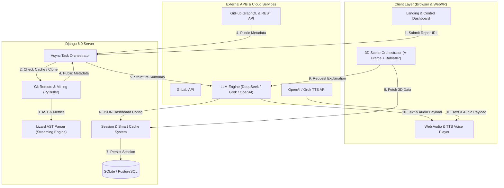

<div align="center">

# 🏙️ ViZo
### *Intelligent Code Analysis & Immersive 3D/VR Visualization Platform*

[](https://www.python.org/)
[](https://www.djangoproject.com/)
[](https://aframe.io/)
[](https://api.deepseek.com/)
[](Dockerfile)
[](LICENSE)

<p align="center">
  <b>ViZo</b> transforma repositorios de código de GitHub y GitLab en <b>centros de mando inmersivos 3D y de Realidad Virtual (VR)</b>. Integra motores estáticos de extracción de métricas de software con Inteligencia Artificial (LLM) y síntesis de voz en tiempo real para visualizar la salud, arquitectura y evolución de proyectos de software.
</p>

---

</div>

## 📌 Tabla de Contenidos
- [✨ Características Principales](#-características-principales)
- [🏗️ Arquitectura del Sistema](#️-arquitectura-del-sistema)
- [🛠️ Stack Tecnológico y Dependencias](#️-stack-tecnológico-y-dependencias)
- [🌐 APIs Externas e Integraciones](#-apis-externas-e-integraciones)
- [🔐 Variables de Entorno (`.env`)](#-variables-de-entorno-env)
- [🚀 Guía de Inicio Rápido (Quick Start)](#-guía-de-inicio-rápido-quick-start)
- [🐳 Despliegue con Docker](#-despliegue-con-docker)
- [📂 Estructura del Proyecto](#-estructura-del-proyecto)
- [📄 Licencia](#-licencia)

---

## ✨ Características Principales

### 🌇 1. Ciudad de Código 3D (`babia-boats`)
* Visualización metafórica de archivos fuente como edificios tridimensionales.
* **Mapeo Dimensional**: Altura $\rightarrow$ Líneas de Código (`NLOC`), Área de base $\rightarrow$ Complejidad Ciclomática (`CCN`), Color $\rightarrow$ Actividad de commits.

### 📊 2. Centro de Mando VR con 8 Dashboards Dinámicos
* Renderizado automático en **A-Frame** y **BabiaXR**.
* **Gráficos 3D**: Bar Charts 3D, Cylinder Charts 3D (`babia-cyls`), Doughnut/Pie 3D, 3D Grid Maps (`babia-barsmap`) y Grafos de Red 3D (`babia-network`).

### ⚡ 3. Motor de Análisis Estático Resiliente (Lizard + PyDriller)
* **Lizard AST Parser**: Extracción multihilo de métricas de complejidad ciclomática (`CCN`) y volumen de líneas (`NLOC`).
* **Streaming por Lotes y Muestreo Inteligente**: Algoritmo de muestreo uniforme para repositorios masivos (>15.000 archivos) con recepción de lotes progresivos IPC y salvaguarda de resultados parciales ante tiempos límite.
* **PyDriller & Dulwich**: Minería de datos de Git en profundidad para calcular la tasa de cambio (*churn*), propiedad de código y antigüedad (*code age*).

### 🧠 4. Asistente Arquitectónico impulsado por IA (DeepSeek / Grok / OpenAI)
* **Generación Automática de Visualizaciones**: La IA analiza las estadísticas del repositorio y selecciona de 1 a 8 dashboards óptimos sin duplicidad de datasets.
* **Diagnóstico de Salud**: Generación de resúmenes ejecutivos, detección de problemas críticos y recomendaciones de refactorización para cada dashboard.

### 🎙️ 5. Narración por Voz TTS (Text-to-Speech)
* Integración con la API de voz de **Grok / OpenAI (TTS-1)** para ofrecer explicaciones auditivas de la arquitectura en tiempo real directamente en la escena 3D.

### 🌍 6. Internacionalización Bilingüe (ES / EN)
* Alternancia dinámica entre **Español** e **Inglés** en tiempo real.
* Traduce paneles de control 3D, interfaz de usuario, respuestas del asistente de IA y narraciones por voz TTS.

### 🏆 7. Muro de la Fama y Trofeos 3D
* Visualización en la escena 3D del Top 3 de desarrolladores en podios metálicos con texturas personalizadas, junto con trofeos dorados de Estrellas y Forks extraídos de GitHub/GitLab.

---

## 🏗️ Arquitectura del Sistema



---

## 🛠️ Stack Tecnológico y Dependencias

| Componente | Tecnología | Descripción |
| :--- | :--- | :--- |
| **Backend Core** | `Django 6.0.2` | Framework web principal en Python 3.11+ |
| **Servidor WSGI** | `gunicorn 23.0.0` | Servidor de producción HTTP para entornos en contenedor |
| **Análisis Estático** | `lizard 1.21.0` | Extracción multihilo de Complejidad Ciclomática (CCN) y NLOC |
| **Minería de Git** | `PyDriller 2.9` / `dulwich` | Análisis del historial de commits, deltas y autores |
| **Integración IA** | `openai 2.24.0` | SDK oficial compatible con DeepSeek v4, Grok y OpenAI |
| **Seguridad & Entorno**| `cryptography 46.0.5` / `python-dotenv` | Encriptación AES de tokens y carga de variables `.env` |
| **Peticiones HTTP** | `requests 2.32.5` | Integración con APIs REST y GraphQL externas |
| **Base de Datos** | `psycopg2-binary 2.9.11` | Adaptador para PostgreSQL en entornos de producción |
| **Visualización 3D/VR**| `A-Frame 1.4+` / `BabiaXR` | Renderizado 3D inmersivo WebXR en navegador |

---

## 🌐 APIs Externas e Integraciones

ViZzo se conecta con servicios cloud de primera categoría para enriquecer el análisis:

1. **GitHub API (GraphQL & REST v3)**:
   - Extracción de métricas de comunidad: Pull Requests, Code Reviews, Releases Health e Issues.
2. **GitLab API**:
   - Soporte para consulta de metadatos de repositorios públicos y privados en GitLab.
3. **DeepSeek / Grok / OpenAI API**:
   - Inferencia para decidir la distribución de dashboards y redactar explicaciones de arquitectura.
4. **OpenAI / Grok Text-to-Speech API**:
   - Síntesis de voz dinámica en formato de audio MP3 para guiar al usuario en la experiencia 3D.

---

## 🔐 Variables de Entorno (`.env`)

Crea un archivo `.env` en la raíz del proyecto Django (`ViZo/.env`) con la siguiente configuración base:

```env
# Configuración de Django
SECRET_KEY=tu_clave_secreta_django_aqui
DEBUG=True
ALLOWED_HOSTS=localhost,127.0.0.1

# Proveedores de IA (Opcional si se introducen desde la UI)
OPENAI_API_KEY=sk-...
OPENAI_BASE_URL=https://api.openai.com/v1
DEEPSEEK_API_KEY=sk-...
DEEPSEEK_BASE_URL=https://api.deepseek.com/v1

# Tokens de Proveedores Git (Para aumentar los límites de tasa de API)
GITHUB_TOKEN=ghp_...
GITLAB_TOKEN=glpat-...
```

---

## 🚀 Guía de Inicio Rápido (Quick Start)

### 1. Requisitos Previos
* **Python 3.11** o superior instalado.
* **Git** instalado en el sistema.

### 2. Clonar el Repositorio
```bash
git clone https://github.com/tu-usuario/ViZo.git
cd ViZo
```

### 3. Crear y Activar el Entorno Virtual
En **Windows (PowerShell)**:
```powershell
python -m venv venv
.\venv\Scripts\Activate.ps1
```
En **Linux / macOS**:
```bash
python3 -m venv venv
source venv/bin/activate
```

### 4. Instalar Dependencias
```bash
pip install --upgrade pip
pip install -r requirements.txt
```

### 5. Aplicar Migraciones y Preparar la Base de Datos
```bash
cd ViZo
python manage.py migrate
```

### 6. Iniciar el Servidor de Desarrollo
```bash
python manage.py runserver
```

Navega a **`http://127.0.0.1:8000/`** en tu navegador para comenzar a analizar repositorios.

---

## 🐳 Despliegue con Docker & Docker Compose

ViZzo incluye un **Dockerfile** optimizado con usuario no-root de seguridad (`vizzouser`) y orquestación completa mediante **Docker Compose**:

### 1. Despliegue Automatizado con Docker Compose (Recomendado)
Levanta la base de datos **PostgreSQL 16** y el servidor **Gunicorn/Django** en segundo plano con un solo comando:
```bash
docker compose up -d --build
```
Para ver los logs en tiempo real o detener la infraestructura:
```bash
# Ver logs de la aplicación y la BD
docker compose logs -f

# Detener los servicios
docker compose down
```

### 2. Despliegue Individual con Docker CLI
Si prefieres construir y ejecutar únicamente el contenedor de la aplicación:
```bash
# Construir la imagen
docker build -t vizzo .

# Ejecutar el contenedor
docker run -d -p 8000:8000 --env-file ViZo/.env --name vizzo-app vizzo
```

---

## 📂 Estructura del Proyecto

```text
ViZo/
├── docker-compose.yml          # Orquestación Docker (PostgreSQL 16 + Web Gunicorn)
├── Dockerfile                  # Configuración de contenedor producción (vizzouser)
├── .dockerignore               # Filtro de archivos excluidos en Docker
├── .gitignore                  # Exclusiones de Git
├── requirements.txt            # Dependencias del proyecto Python
├── README.md                   # Documentación principal
└── ViZo/                       # Proyecto Principal Django
    ├── manage.py               # Gestor de comandos de Django
    ├── ViZo/                   # Configuración global del proyecto (settings, urls, wsgi)
    ├── analyzer/               # Aplicación Core de Analítica, AST e IA
    │   ├── core/
    │   │   ├── AI/             # Prompts, cliente OpenAI/DeepSeek y validadores
    │   │   └── ENGINE/         # Motor Lizard, PyDriller, métricas y helpers
    │   ├── services/           # Orquestador asíncrono, caché y proveedor Git
    │   ├── tests/              # Suite de pruebas unitarias e integración (39 tests)
    │   └── views/              # Endpoints API REST para la landing y visualizador
    ├── visualization/          # Vista y renderizado de la sala 3D/VR
    ├── static/                 # Recursos estáticos
    │   ├── css/                # Hojas de estilo personalizadas (Glassmorphism)
    │   └── js/
    │       ├── landing/        # Módulos JS de la landing page
    │       └── visualizer/     # Módulos A-Frame, BabiaXR, paneles 3D y VR
    └── templates/              # Plantillas HTML5 semánticas y bilingües
```

---

## 📄 Licencia

Este proyecto está bajo la Licencia **MIT**. Consulta el archivo [LICENSE](LICENSE) para más información.

<div align="center">
  <sub>Desarrollado con ❤️ para la visualización inmersiva de arquitectura de software.</sub>
</div>
