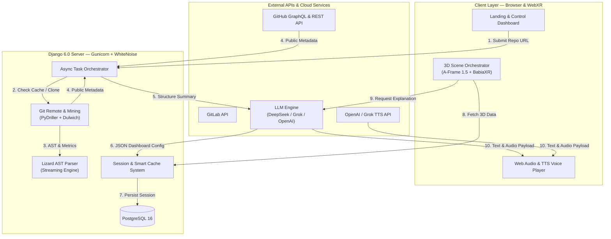
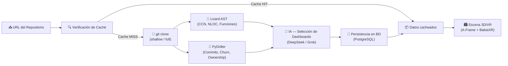

<div align="center">

<a href="https://vizzovr.com">
  
</a>

# **ViZzo**

### _Intelligent Code Analysis & Immersive 3D/VR Visualization Platform_

[](https://vizzovr.com)
[](https://www.python.org/)
[](https://www.djangoproject.com/)
[](https://aframe.io/)
[](https://api.deepseek.com/)
[](Dockerfile)
[](LICENSE)

<p align="center">
  <b>ViZo</b> transforma repositorios de código de GitHub y GitLab en <b>centros de mando inmersivos 3D y de Realidad Virtual (VR)</b>. Integra motores de análisis estático de software con Inteligencia Artificial (LLM) y síntesis de voz en tiempo real para visualizar la salud, arquitectura y evolución de proyectos de software.
</p>

<p align="center">
  <a href="https://vizzovr.com"><b>🔗 Probar ViZo en vivo → vizzovr.com</b></a>
</p>

---

</div>

## 📌 Tabla de Contenidos

- [ Características Principales](#-características-principales)
- [ Arquitectura del Sistema](#%EF%B8%8F-arquitectura-del-sistema)
- [ Pipeline de Análisis](#-pipeline-de-análisis)
- [ Stack Tecnológico](#%EF%B8%8F-stack-tecnológico)
- [ APIs Externas e Integraciones](#-apis-externas-e-integraciones)
- [ Variables de Entorno (`.env`)](#-variables-de-entorno-env)
- [ Guía de Inicio Rápido](#-guía-de-inicio-rápido)
- [ Despliegue con Docker](#-despliegue-con-docker--docker-compose)
- [ Estructura del Proyecto](#-estructura-del-proyecto)
- [ Licencia](#-licencia)

---

## ✨ Características Principales

### 1. Ciudad de Código 3D (`babia-boats`)

- Visualización metafórica de archivos fuente como **edificios tridimensionales** dentro de una sala VR.
- **Mapeo Dimensional**: Altura → Líneas de Código (`NLOC`), Área de base → Complejidad Ciclomática (`CCN`), Color → Actividad de commits o propiedad de código.

### 2. Centro de Mando VR con hasta 8 Dashboards Dinámicos

- Renderizado automático en **A-Frame 1.5** y **BabiaXR**.
- **Gráficos 3D interactivos**: Bar Charts 3D, Cylinder Charts (`babia-cyls`), Doughnut/Pie 3D, Grid Maps (`babia-barsmap`) y Grafos de Red (`babia-network`).
- Paneles de control 3D con textura de madera, botones interactivos y controles de opacidad de la sala.

### 3. Motor de Análisis Estático Resiliente (Lizard + PyDriller)

- **Lizard AST Parser**: Extracción multihilo de métricas de complejidad ciclomática (`CCN`) y volumen de líneas (`NLOC`).
- **Streaming por Lotes y Muestreo Inteligente**: Algoritmo de muestreo uniforme para repositorios masivos (>15.000 archivos) con recepción de lotes progresivos IPC y salvaguarda de resultados parciales ante tiempos límite.
- **PyDriller & Dulwich**: Minería de datos de Git en profundidad para calcular la tasa de cambio (_churn_), propiedad de código y antigüedad (_code age_).

### 4. Asistente Arquitectónico impulsado por IA (DeepSeek / Grok / OpenAI)

- **Generación Automática de Visualizaciones**: La IA analiza las estadísticas del repositorio y selecciona de 1 a 8 dashboards óptimos sin duplicidad de datasets.
- **Diagnóstico de Salud**: Generación de resúmenes ejecutivos, detección de problemas críticos y recomendaciones de refactorización para cada dashboard.

### 5. Narración por Voz TTS (Text-to-Speech)

- Integración con la API de voz de **Grok / OpenAI (TTS-1)** para ofrecer explicaciones auditivas de la arquitectura en tiempo real directamente en la escena 3D.

### 6. Internacionalización Bilingüe (ES / EN)

- Alternancia dinámica entre **Español** e **Inglés** en tiempo real.
- Traduce paneles de control 3D, interfaz de usuario, respuestas del asistente de IA y narraciones por voz TTS.

### 7. Muro de la Fama y Trofeos 3D

- Visualización en la escena 3D del Top 3 de desarrolladores en podios metálicos con texturas personalizadas, junto con trofeos dorados de Estrellas y Forks extraídos de GitHub/GitLab.

---

## Arquitectura del Sistema



---

## Pipeline de Análisis



---

## Stack Tecnológico

| Capa                   | Tecnología          | Versión  | Descripción                                     |
| :--------------------- | :------------------ | :------: | :---------------------------------------------- |
| **Backend Core**       | Django              | `6.0.2`  | Framework web principal en Python 3.11+         |
| **Servidor WSGI**      | Gunicorn            | `23.0.0` | Servidor HTTP de producción para contenedores   |
| **Archivos Estáticos** | WhiteNoise          | `6.12.0` | Servicio de estáticos comprimidos en producción |
| **Base de Datos**      | PostgreSQL          |   `16`   | BD relacional en contenedor (Alpine)            |
| **Adaptador BD**       | psycopg2-binary     | `2.9.11` | Driver PostgreSQL para Python                   |
| **Análisis Estático**  | Lizard              | `1.21.0` | Extracción multihilo de CCN y NLOC              |
| **Minería de Git**     | PyDriller / Dulwich |  `2.9`   | Historial de commits, deltas y autores          |
| **Integración IA**     | OpenAI SDK          | `2.24.0` | Compatible con DeepSeek, Grok y OpenAI          |
| **Seguridad**          | cryptography        | `46.0.5` | Encriptación AES de tokens OAuth                |
| **Entorno**            | python-dotenv       | `1.2.1`  | Carga de variables `.env`                       |
| **Peticiones HTTP**    | requests            | `2.32.5` | Integración con APIs REST y GraphQL             |
| **Visualización 3D**   | A-Frame             | `1.5.0`  | Renderizado 3D inmersivo WebXR                  |
| **Dashboards 3D**      | BabiaXR             | `latest` | Componentes de gráficos 3D para A-Frame         |
| **Extensiones 3D**     | aframe-extras       | `7.2.0`  | Controles de movimiento y animaciones           |

---

## 🌐 APIs Externas e Integraciones

ViZzo se conecta con servicios cloud para enriquecer el análisis:

1. **GitHub API (GraphQL & REST v3)**:
   - Extracción de métricas de comunidad: Pull Requests, Code Reviews, Releases Health e Issues.
   - Autenticación OAuth para repositorios privados.
2. **GitLab API**:
   - Soporte para consulta de metadatos de repositorios públicos y privados en GitLab.
   - Autenticación mediante token personal (`glpat-...`).
3. **DeepSeek / Grok / OpenAI API**:
   - Inferencia LLM para decidir la distribución de dashboards y redactar explicaciones de arquitectura.
   - Proveedor y modelo configurables desde la interfaz web.
4. **OpenAI / Grok Text-to-Speech API**:
   - Síntesis de voz dinámica en formato MP3 para narrar explicaciones directamente en la escena 3D.

---

## Variables de Entorno (`.env`)

Crea un archivo `.env` en la raíz del proyecto Django (`ViZo/.env`) con la siguiente configuración base:

```env
# ── Django Core ──
SECRET_KEY=tu_clave_secreta_django_aqui
DJANGO_DEBUG=True
ALLOWED_HOSTS=localhost,127.0.0.1

# ── Base de Datos (Docker Compose gestiona estos valores) ──
DB_ENGINE=django.db.backends.postgresql
DB_NAME=ViZo_DB
DB_USER=postgres
DB_PASSWORD=postgres_secure_password
DB_HOST=localhost
DB_PORT=5432

# ── Proveedores de IA (Opcional: configurables desde la UI) ──
OPENAI_API_KEY=sk-...
OPENAI_BASE_URL=https://api.openai.com/v1
DEEPSEEK_API_KEY=sk-...
DEEPSEEK_BASE_URL=https://api.deepseek.com/v1

# ── Tokens de Proveedores Git (Aumentan los rate limits de API) ──
GITHUB_TOKEN=ghp_...
GITLAB_TOKEN=glpat-...
```

---

## Guía de Inicio Rápido

### 1. Requisitos Previos

- **Python 3.11** o superior.
- **Git** instalado en el sistema.
- **PostgreSQL 16** en ejecución (o usar Docker Compose).

### 2. Clonar el Repositorio

```bash
git clone https://github.com/PiRuLeT4/Vizzo.git
cd Vizzo
```

### 3. Crear y Activar el Entorno Virtual

**Windows (PowerShell):**

```powershell
python -m venv venv
.\venv\Scripts\Activate.ps1
```

**Linux / macOS:**

```bash
python3 -m venv venv
source venv/bin/activate
```

### 4. Instalar Dependencias

```bash
pip install --upgrade pip
pip install -r requirements.txt
```

### 5. Configurar Variables de Entorno

```bash
cp ViZo/.env.example ViZo/.env
# Edita ViZo/.env con tu SECRET_KEY y credenciales de BD
```

### 6. Aplicar Migraciones

```bash
cd ViZo
python manage.py migrate
```

### 7. Iniciar el Servidor de Desarrollo

```bash
python manage.py runserver
```

Navega a **`http://127.0.0.1:8000/`** para comenzar a analizar repositorios.

---

## 🐳 Despliegue con Docker & Docker Compose

ViZo incluye un **Dockerfile** optimizado con usuario no-root (`vizzouser`) y orquestación completa mediante **Docker Compose** con PostgreSQL 16:

### Despliegue con Docker Compose (Recomendado)

```bash
# Levantar PostgreSQL 16 + Gunicorn/Django en segundo plano
docker compose up -d --build

# Ver los logs en tiempo real
docker compose logs -f

# Detener los servicios
docker compose down
```

### Despliegue Individual con Docker CLI

```bash
# Construir la imagen
docker build -t vizzo .

# Ejecutar el contenedor
docker run -d -p 8000:8000 --env-file ViZo/.env --name vizzo-app vizzo
```

> **Nota**: En producción, ViZzo está desplegado en [**vizzovr.com**](https://vizzovr.com) con contenedores Docker sobre un VPS Linux.

---

## Estructura del Proyecto

```text
Vizzo/
├── docker-compose.yml          # Orquestación Docker (PostgreSQL 16 + Gunicorn)
├── Dockerfile                  # Imagen de producción (Python 3.12-slim, vizzouser)
├── requirements.txt            # Dependencias Python del proyecto
├── LICENSE                     # Licencia MIT
├── README.md                   # Esta documentación
└── ViZo/                       # Proyecto Django
    ├── manage.py               # Gestor de comandos Django
    ├── ViZo/                   # Configuración global (settings, urls, wsgi)
    ├── analyzer/               # App Core: Análisis, AST e IA
    │   ├── core/
    │   │   ├── AI/             # Prompts, cliente LLM y validadores JSON
    │   │   └── ENGINE/         # Motor Lizard, PyDriller, métricas y helpers
    │   ├── services/           # Orquestador asíncrono, caché y seguridad
    │   ├── tests/              # Suite de pruebas (39 tests)
    │   └── views/              # Endpoints API REST
    ├── visualization/          # App: Renderizado de la sala 3D/VR
    ├── static/
    │   ├── css/                # Estilos (Glassmorphism, dark mode)
    │   ├── images/             # Texturas 3D (madera, mármol, skyboxes)
    │   └── js/
    │       ├── landing/        # Módulos JS de la landing page
    │       └── visualizer/     # A-Frame, BabiaXR, paneles 3D y VR
    └── templates/              # Plantillas HTML5 (bilingüe ES/EN)
```

---

## 📄 Licencia

Este proyecto está bajo la Licencia **MIT**. Consulta el archivo [LICENSE](LICENSE) para más información.

<div align="center">

---

<sub>Trabajo fin de grado</sub>

<a href="https://vizzovr.com"><b>vizzovr.com</b></a>

</div>
